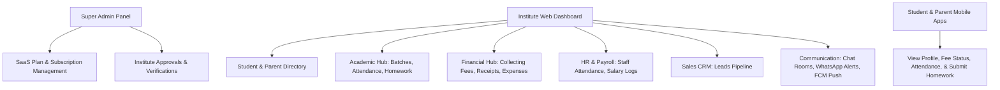

# Fee Easy / Tuoora Education ERP — Project Documentation

Welcome to the comprehensive technical documentation for **Fee Easy / Tuoora ERP**, a multi-tenant Education ERP and Tuition SaaS platform built on the Laravel framework. This system is designed to streamline administrative workflows, simplify student/staff management, automate fee collection/payment processing, facilitate teacher-parent-student communication, and generate analytics-driven reports.

---

## 💻 Tech Stack & Architecture

- **Backend Framework**: Laravel 10.x (PHP ^8.1)
- **Database**: MySQL (relational database with structured Eloquent models)
- **Authentication**: Laravel Sanctum (token-based API authentication for Mobile/API client) & Web Guards (session-based authentication for Web portal)
- **Real-Time Communication**: Pusher SDK / Laravel WebSockets (via `beyondcode/laravel-websockets`)
- **PDF Generation**: `barryvdh/laravel-dompdf` (for fee receipts, transcripts, reports)
- **Payment Gateway**: Razorpay Integration (`razorpay/razorpay`) & Stripe
- **Push Notifications**: Firebase Cloud Messaging (FCM) Integration
- **SMS/WhatsApp Notifications**: Meta WhatsApp Cloud API Integration
- **Role/Permission Management**: `spatie/laravel-permission` (fine-grained control for staff/admins)

---

## 📂 Directory & File Structure

A standard Laravel MVC architecture is followed:

```
fee_easy/
├── app/
│   ├── Http/
│   │   ├── Controllers/
│   │   │   ├── Api/          # Mobile/App API Endpoints (V1)
│   │   │   └── Web/          # Web Panel (Admin/Institute/Parent dashboards)
│   │   └── Middleware/       # Custom Auth, Verification, & CSRF middlewares
│   ├── Models/               # 41 Eloquent Models mapping database tables
│   ├── Providers/            # Service Providers (Route, Auth, Event configuration)
│   └── Services/             # Business Logic wrappers (e.g. WhatsApp, FCM Services)
├── config/                   # Configuration files (database, mail, sanctum, etc.)
├── database/
│   ├── migrations/           # 90+ Migration files representing DB schema
│   └── seeders/              # Database seeders for plans, roles, default users
├── docs/                     # Markdown files detailing API endpoints
├── resources/
│   ├── views/                # Blade Templates for Admin & Institute dashboard panels
│   └── js/ & css/            # Frontend assets (Tailwind, Vue/React component configs)
├── routes/
│   ├── api.php               # API routes (prefixed with /api)
│   └── web.php               # Session-based Web routes (Admin & Institute panels)
└── deploy_live.sh            # Live server shell deployment script
```

---

## 🛠️ Key System Modules & Features



### 1. Multi-Tenant Role & Authentication Center
- **System Admin Panel**: Manages SaaS operations, active plans, institute listings, overall revenues, and broadcasts.
- **Institute Panel**: ERP dashboard for institute directors and admins to manage daily operations.
- **Student Auth**: Personal logins for students to view progress, attendance, and homework.
- **Parent Auth**: Dedicated logs for parents to track their ward's academic status and make fee payments.
- **Security**: Sanctum API authentication, secure password hashing, and dynamic OTP verification during registration or reports generation.

### 2. Academics & Course Registry
- **Batch Management**: Organize classes by standard, batch capacity, classroom assignment, days of the week, and fees.
- **Student Database**: Tracks date-of-birth, unique profile ID hashes, avatars, status, and parents' details.
- **Attendance Tracker**: Track student attendance per batch (Present, Absent, Leave). Reports can be generated and sent via WhatsApp.
- **Daily Teaching Logs**: Logs topics covered and descriptions, keeping students and parents in the loop.
- **Homework Module**: Set homework assignments, upload resource files, submit solutions (from students), and score/grade submissions with automatic notifications.

### 3. Billing, Revenue, & Finance
- **Fee Management**: Create structured fee cycles, monthly or yearly amounts, and due reminders.
- **Payment Collection**: Record payments via Credit Card, Cash, Bank Transfer, Razorpay, or Stripe.
- **PDF Receipt System**: Generates downloadable transactional receipts using DOMPDF.
- **Expense Book**: Categories for overheads, payment methods, expense logs, and periodic expense analysis reports.

### 4. HR, Payroll, & Staff CRM
- **Staff Directory**: Add teachers, administrators, and coordinators with unique roles and department associations.
- **Staff Attendance**: Track daily check-in/check-out logs.
- **Payroll Manager**: Generate monthly salary sheets, process pay summaries, export salary sheets, and handle bonuses/deductions.

### 5. Sales Pipeline (Leads CRM)
- **Leads Register**: Add prospective students, assign lead statuses (Cold, Warm, Hot, Enrolled), log communication timelines, track referrers, and add detailed logs.

### 6. Communication Suite
- **1-to-1 Chat & Channels**: Instant chat messages between students, parents, and institute coordinators. Real-time updates powered by WebSockets.
- **Push Notification Hub**: Broadcast push alerts via Firebase (FCM) based on customized notification settings.
- **WhatsApp Cloud API Integration**: Direct updates to parents for fee reminders, OTP verifications, daily updates, and attendance alerts.

---

## 🗄️ Database Design (Core Models & Relations)

Below are the key models representing the database schema:

| Model | Description | Crucial Relationships |
| :--- | :--- | :--- |
| **Institute** | The Tenant. Represents a coaching center or school. | Has many `Student`, `Batch`, `Teacher`, `Lead`, `Subscription` |
| **Student** | Represents an enrolled student. | Belongs to `Batch` & `Parent`, has many `Attendance`, `Fee` |
| **StudentParent** | The parent or guardian linked to students. | Has many `Student` |
| **Batch** | Class groups under an institute. | Belongs to `Institute`, has many `Student` & `Homework` |
| **Fee** | Fee record assigned to a student for a month/year. | Belongs to `Student`, has many `Payment` |
| **Payment** | Transactions registered against a `Fee` invoice. | Belongs to `Fee`, has one `Receipt` |
| **Staff / Teacher** | Institute employees. | Belongs to `Institute`, has many `StaffAttendance` & `StaffSalary` |
| **Note** | Rich text notepad records with tags and checklists. | Belongs to `User` / `Institute`, has many `NoteChecklist` |
| **ChatMessage** | Message records between users. | Belongs to sender/receiver |
| **Lead** | CRM prospective client registers. | Belongs to `Institute`, has many `LeadNote` |

---

## 🌐 API Integrations & Web Panel Routes

### API Endpoint Categories (Prefix: `/api/v1/`)

1. **Institute Route Group** (`/api/v1/institute/*`)
   - `POST /login`, `POST /register`, `POST /verify-otp`
   - `GET /profile`, `POST /logo/upload`
   - `GET|POST /daily-updates`, `GET|POST /homeworks`
   - `POST /notifications/send`, `GET|POST /whatsapp-settings`
   - `GET /reports/dashboard`, `GET /reports/fee`, `GET /reports/attendance`
   - `GET /subscription`, `POST /subscription/renew`

2. **Student Route Group** (`/api/v1/student/*`)
   - `POST /login`, `GET /profile`, `GET /dashboard`
   - `GET /fees`, `GET /receipts`, `GET /attendance`
   - `GET /daily-updates`, `GET /homeworks`, `POST /homeworks/{id}/submit`
   - `GET /report`, `GET /notifications`

3. **Parent Route Group** (`/api/v1/parent/*`)
   - `POST /login`, `GET /profile`, `GET /dashboard`
   - `GET /fees`, `POST /pay-fee`, `GET /receipts`
   - `GET /attendance`, `GET /daily-updates`, `GET /homeworks`

4. **Internal Admin & Web Panel**
   - Main Super Admin dashboard (`/admin/dashboard`) handles platform-wide management.
   - Institute Web Dashboard (`/institute/dashboard`) contains modules for student creation, attendance registry, and payment collections.

---

## 🚀 Installation & Local Setup

### System Prerequisites
- PHP >= 8.1
- Composer
- MySQL Database
- Node.js & NPM

### Local Installation Guide
1. **Clone & Install Dependencies**:
   ```bash
   composer install
   npm install
   ```
2. **Environment File Configuration**:
   Copy `.env.example` to `.env` and configure key variables:
   ```env
   APP_NAME="Fee Easy"
   APP_ENV=local
   APP_KEY=base64:...
   APP_URL=http://localhost:8000

   DB_CONNECTION=mysql
   DB_HOST=127.0.0.1
   DB_PORT=3306
   DB_DATABASE=fee_easy
   DB_USERNAME=root
   DB_PASSWORD=

   PUSHER_APP_ID=
   PUSHER_APP_KEY=
   PUSHER_APP_SECRET=
   PUSHER_APP_CLUSTER=mt1

   RAZORPAY_KEY_ID=
   RAZORPAY_KEY_SECRET=
   ```
3. **Run Migrations & Seeders**:
   ```bash
   php artisan migrate --seed
   ```
4. **Link Storage**:
   ```bash
   php artisan storage:link
   ```
5. **Run the Servers**:
   ```bash
   php artisan serve
   npm run dev
   ```

---

## 🖥️ Live Production Deployment

Deployments are automated using the local `deploy_live.sh` script, which automates production workflows on the `tuoora.com` server:

```bash
# To run live deployment:
./deploy_live.sh
```

**Actions executed by script:**
1. Pulls the latest code from the active Git branch.
2. Puts the site into maintenance mode (`php artisan down`).
3. Installs optimized, non-dev Composer dependencies.
4. Compiles production assets via Vite (`npm run build`).
5. Caches configuration, routes, and views.
6. Runs database migrations automatically (`php artisan migrate --force`).
7. Sets storage directory permissions.
8. Re-activates the live application (`php artisan up`).

---

> [!NOTE]
> Detailed API endpoint payloads and sample JSON structures can be reviewed in the custom files inside the [docs/](file:///c:/xampp/htdocs/fee_easy/docs) folder.
